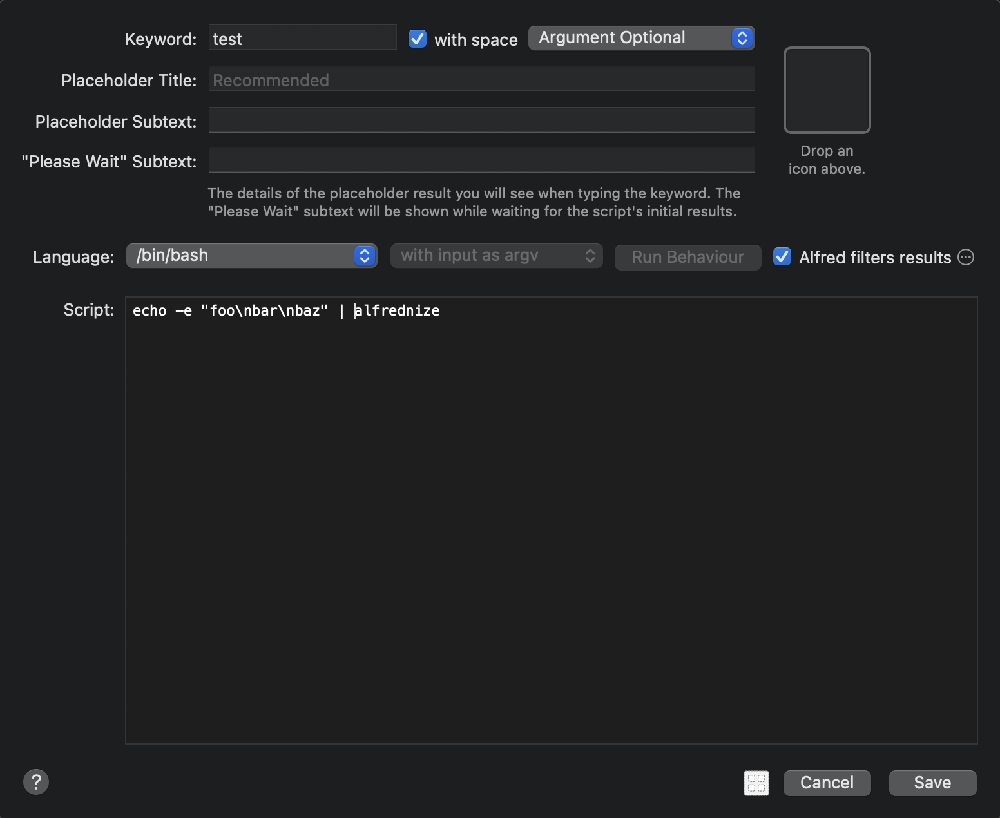
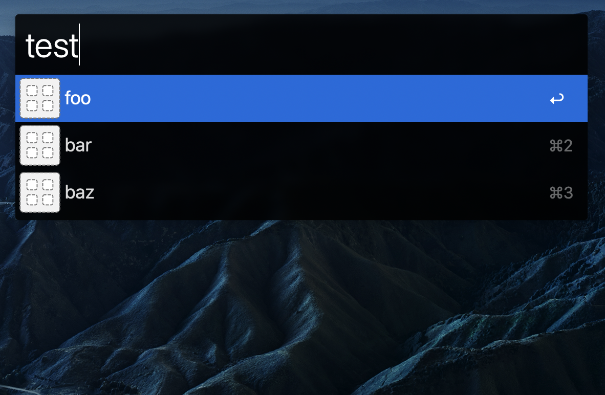

alfrednize
==========

[](https://github.com/chroju/alfrednize/releases)
[](https://github.com/chroju/alfrednize/actions?workflow=test)
[](https://coveralls.io/github/chroju/alfrednize?branch=main)

alfrednize is a so simple command to generate JSON for [Alfred](https://www.alfredapp.com/).

Usage
-----

Use with standard input. `alfrednize` converts multiline strings to JSON with [Alfred Script Filter JSON Format](https://www.alfredapp.com/help/workflows/inputs/script-filter/json/).

```json
$ echo -e 'foo\nbar\nbaz' | alfrednize | jq
{
  "items": [
    {
      "uid": "foo",
      "title": "foo",
      "subtitle": "",
      "arg": "foo",
      "match": "foo",
      "autocomplete": "foo"
    },
    {
      "uid": "bar",
      "title": "bar",
      "subtitle": "",
      "arg": "bar",
      "match": "bar",
      "autocomplete": "bar"
    },
    {
      "uid": "baz",
      "title": "baz",
      "subtitle": "",
      "arg": "baz",
      "match": "baz",
      "autocomplete": "baz"
    }
  ]
}
```

Use with Script Filter in Alfred as follows.




## Install

### Homebrew

```bash
$ brew install chroju/tap/alfrednize
```

### Download binary

Download the latest binary from [here](https://github.com/chroju/alfrednize/releases) and place it in the some directory specified by `$PATH`.

### go get

If you have set up Go environment, you can also install `alfrednize` with `go get` command.

```
$ go get github.com/chroju/alfrednize
```

### LICENSE

[MIT](https://github.com/chroju/alfrednize/LICENSE)
